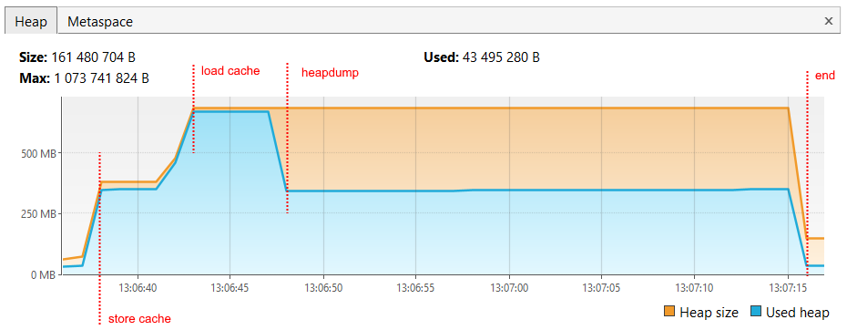
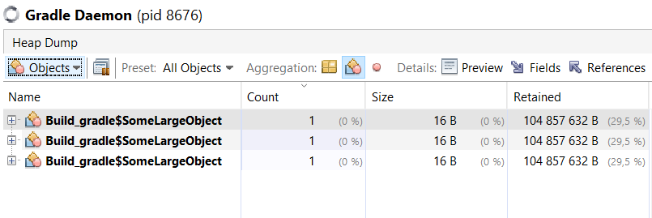
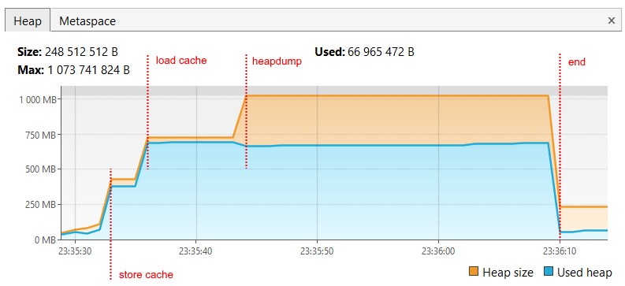
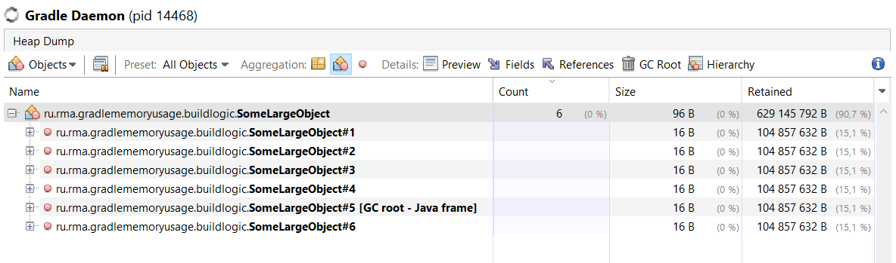

# Gradle memory usage

Данный проект показывает, как Gradle по-разному использует память при включенном кэше конфигурации,
в зависимости от структуры проекта.

Все примеры содержат три пустых java-модуля. Отличаются они только тем, как организована логика сборки:
- [without-include-build](https://github.com/rmarma/gradle-memory-usage/tree/without-include-build) -
в данном примере нет include-билдов, задачи gradle регистрируются в каждом модуле отдельно вручную.
- [with-include-build](https://github.com/rmarma/gradle-memory-usage/tree/with-include-build) -
данный пример отличается от предыдущего тем, что регистрация задач gradle вынесена в отдельный include-билд,
в плагин, который применяется во всех модулях.

**Пример без include-билдов**

**Пример с include-билдом**

Подробней можно прочитать в каждом примере отдельно.

## Итог

- Потребление памяти отличается в зависимости от структуры проекта;
- Если включен кэш конфигурации, актуального кэша нет, и логика сборки вынесена в отдельный include-билд, то Gradle
выделяет в два раза больше памяти на конфигурацию и удерживает её до конца сборки.
