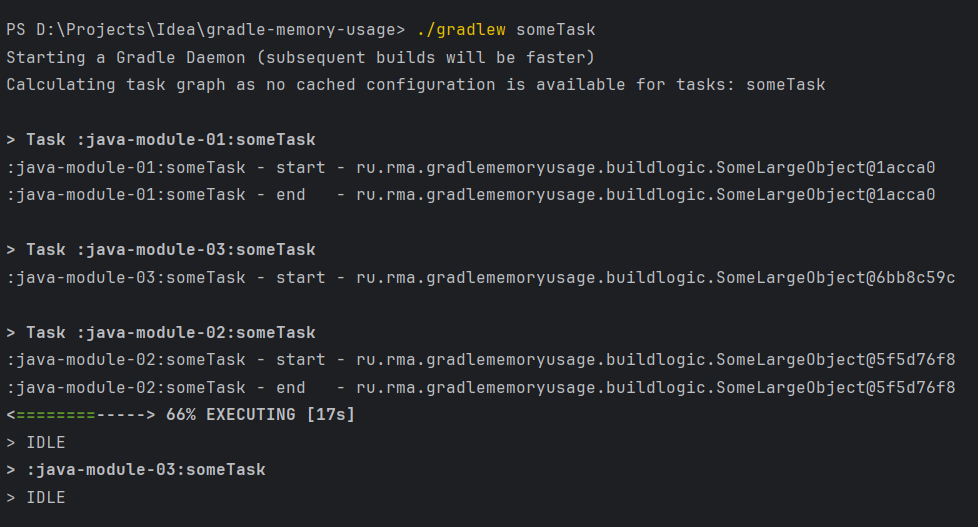
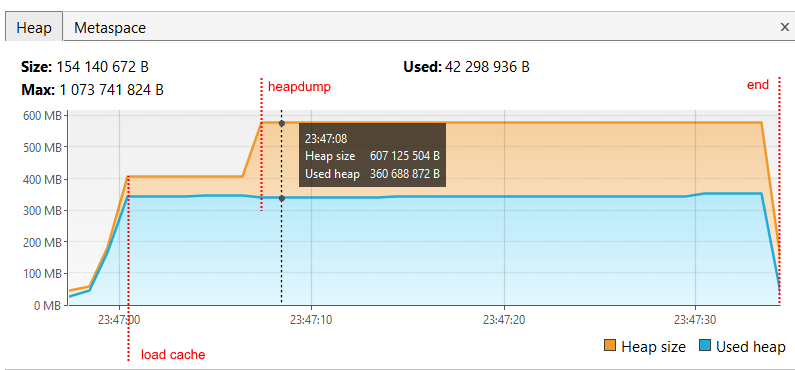

# Gradle memory usage

Данный пример показывает, как используется память при включенном кэше конфигурации на `Gradle 8.10`.

Проект состоит из трёх пустых java-модулей и содержит один include-билд `build-logic`:
- `java-module-01`
- `java-module-02`
- `java-module-03`

`build-logic` содержит плагин `convention.some-task`, который регистрирует в модуле таску `someTask`.
Данный плагин применяется во всех модулях.
Таска `someTask` принимает на вход _тяжёлый_ объект в **100** МБ и условное время выполнения задачи
(в первом модулей **1** секунда, во втором - **5**, в третьем - **30** секунд).
Объект на 100 МБ нужен, чтобы на графиках наглядней выделялись моменты выделения и освобождения памяти.

## Эксперимент

Запускаем задачу `someTask` во всех модулях сразу командой:
```shell
./gradlew someTask
```

Снимаем dump памяти в момент, когда в первых двух модулях задачи закончили выполняться, а в последнем ещё нет:



Получаем такую картину по памяти:


Вначале графика видно выделение **300** МБ памяти во время вычисления и сохранения кэша конфигурации.
Это наши _тяжёлые_ объекты для каждой задачи `someTask`.

Потом мы видим как выделилось ещё **300** МБ. Это также наши _тяжёлые_ объекты,
но на этот раз прочитанные из сохранённого кэша конфигурации.
То есть Gradle в рамках одной сборки вычисляет кэш конфигурации, сохраняет его и заново читает, поэтому потребовалось
повторное выделение памяти.

Далее видим, что во время снятия dump'а памяти принудительно вызывается сборщик мусора, но
ненужные объекты в **300** МБ не удаляются. Gradle удерживает их до конца сборки.

Такая ситуация происходит, когда у нас включен кэш конфигурации, но самого кэша нет.
Если же кэш есть, то он просто прочитается один раз, и повторного выделения памяти не будет:



Однако, на обоих графиках видна другая проблема. Задачи в первых двух модулях закончили своё выполнение,
но входные данные для них продолжают удерживаться в памяти до самого завершения сборки.
Такая же картина будет, если выключить кэш конфигурации, поэтому к нему она не относится.

В dump'е мы видим 6 наших _тяжёлых_ объектов:


Если воспользуемся инструментом [Memory Analyzer](https://eclipse.dev/mat/), то он нам подсветит,
что есть проблема с утечкой памяти:


Там же и увидим наши 6 объектов:


Которые удерживаются следующими потоками:


При наличии актуального кэша конфигурации такой проблемы нет:


## Итог

- Если кэш конфигурации включен, но самого кэша нет, и проект содержит include-билд с логикой сборки, то произойдёт
повторное выделение памяти, которое будет удерживаться до самого завершения сборки;
- Если кэш конфигурации включен, и есть актуальный кэш, повторного выделения памяти не будет;
- Gradle удерживает в памяти входные данные для задач, даже после их выполнения, но к кэшу конфигурации это не имеет
  отношения.

На лицо явная проблема с утечкой памяти при сохранении и повторной загрузке кэша конфигурации на проектах, содержащих
логику сборки в отдельном incude-билде.
